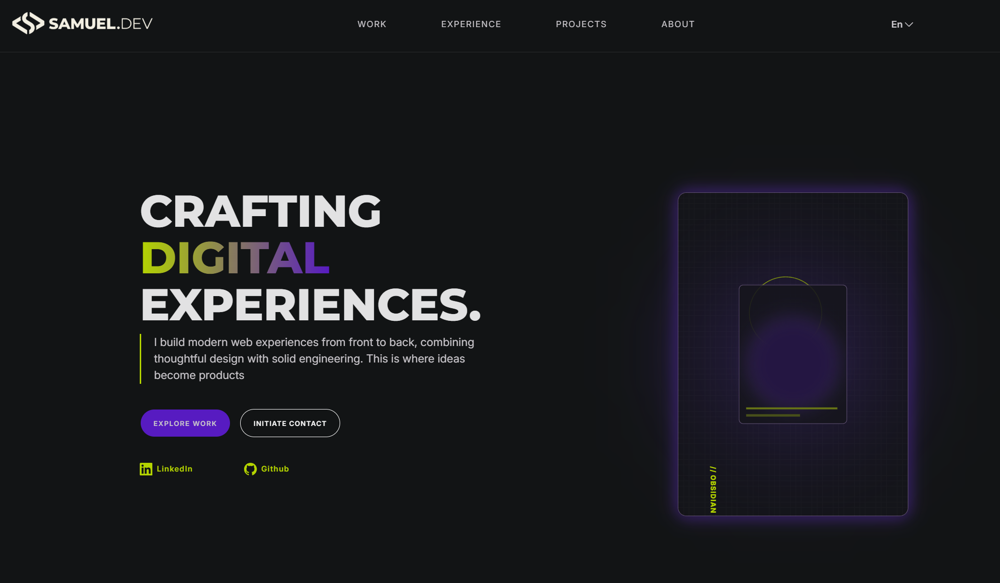

# Samuel.dev — Personal Portfolio



A design-driven personal portfolio built from scratch with **React, JavaScript, Sass and Vite**.

The project was created to present my professional experience, technical skills and personal work through an interface that feels closer to a digital product than a traditional developer portfolio.

The main focus is not only on presenting information, but on combining **clean engineering, responsive layouts, interaction and a distinctive visual identity**.

---

## ✦ Overview

**Samuel.dev** is my personal developer portfolio and a central place to showcase my work as a Full-Stack Developer with a strong focus on front-end development.

The website brings together:

* Professional experience
* Technical skills
* Full-stack applications
* Front-end recreations
* UI and design-focused projects
* Personal information
* CV access
* Contact and social links

The interface was designed and developed from scratch, with special attention to visual hierarchy, spacing, typography, motion and responsive behaviour.

---

## ✦ Design

One of the main goals of this portfolio was to move away from the typical developer portfolio layout and create something with a stronger visual identity.

The interface follows a dark, technology-inspired aesthetic built around deep backgrounds, vibrant **lime and purple accents**, subtle borders, gradients and carefully controlled contrast.

Several visual elements reinforce this identity:

* A custom geometric and animated hero composition.
* Gradient typography and accent elements.
* A translucent fixed navigation bar with backdrop blur.
* Large editorial-style typography.
* Dynamic project layouts instead of a uniform card grid.
* Image-driven project cards with gradients and interactive states.
* Smooth transitions and subtle animations throughout the interface.
* A custom project modal designed around the **“Obsidian Engine”** visual concept.
* Responsive typography and spacing using tools such as `clamp()`.
* Different grid compositions depending on the type of project being displayed.

The result is an interface designed to feel **modern, technical and intentionally crafted**, while keeping the content readable and the projects at the centre of the experience.

---

## ✦ Features

### 🌍 Multilingual interface

The portfolio can be displayed in:

* English
* Spanish
* Portuguese

Content such as navigation, professional experience, project descriptions, calls to action and the About section is dynamically translated.

The language system is built around a centralized translation structure, making additional languages easy to integrate.

---

### 🧭 Scroll-aware navigation

The navigation automatically detects which main section of the portfolio is currently being viewed.

This is implemented using the browser's `IntersectionObserver` API, allowing the corresponding navigation element to react to the user's position on the page without relying on continuous scroll event calculations.

---

### 📱 Responsive navigation

The desktop navigation transforms into a dedicated hamburger menu on smaller screens.

The layout adapts across different viewport sizes using reusable Sass breakpoints, fluid dimensions and responsive typography.

---

### 💼 Experience

Professional experience is generated from structured data and displayed through reusable React components.

Each position contains localized information such as:

* Role
* Company
* Dates
* Description

Keeping the data separated from the presentation layer makes the section easier to maintain and extend.

---

### 🧰 Skills

The Skills section presents technologies from across my stack, including:

**Front-end**

`React` · `Angular` · `JavaScript` · `TypeScript` · `HTML` · `CSS` · `Sass`

**Back-end & APIs**

`Node.js` · `Express` · `REST APIs`

**Data**

`PostgreSQL` · `SQL`

**Testing & Development**

`Jest` · `Supertest` · `Git` · `Docker` · `Vite`

Each technology carries its own visual identity through icons and dynamically assigned accent colours.

---

## ✦ Projects

Projects are separated into three categories instead of being presented as a single homogeneous list.

### Apps

Complete applications where functionality and software architecture play a central role.

Examples include full-stack projects integrating technologies such as React, Node.js, Express, PostgreSQL, Docker, testing tools and external APIs.

### Recreations

Interfaces and applications recreated as front-end exercises.

These projects focus on accurately reproducing:

* Layouts
* Responsive behaviour
* Visual hierarchy
* Interactions
* Existing product interfaces

### Designs

Projects where visual design, layout experimentation and interface presentation play a particularly important role.

This category includes original concepts as well as websites created around specific brands or businesses.

---

## ✦ Dynamic project system

Projects are stored as structured data and dynamically rendered by React.

Selecting a category filters the available projects while the navigation underline automatically recalculates its size and position.

Each project card can include:

* Project image
* Description
* Technologies
* Development state
* Repository
* Front-end repository
* Back-end repository
* Live demo

Clicking a project opens a custom modal containing its preview and available links.

For full-stack projects, front-end and back-end repositories can be displayed independently.

Background scrolling is temporarily disabled while the project modal is open and restored automatically when it closes.

---

## ✦ Project highlights

Some of the work currently showcased includes:

### GitHub Search

A full-stack application for searching GitHub users and repositories and exploring their profiles, activity and repositories through the GitHub API.

The project combines technologies such as React, Sass, Node.js, Express, PostgreSQL, Jest, Supertest, Docker and CI/CD.

### Mental Quotes

A full-stack application designed around discovering and filtering quotes from philosophers and other notable figures.

Built with React, React Router, Sass, Node.js, Express and PostgreSQL.

### GoDaddy Recreation

A front-end recreation focused on reproducing GoDaddy's layout, visual hierarchy and responsive behaviour.

### Lobe Recreation

A responsive recreation built as an exercise in precise interface reproduction and layout implementation.

### Tic-Tac-Toe

An interactive recreation of the classic game with its logic implemented in JavaScript.

### Nintendo React

A Nintendo-inspired interface based around an original interpretation of the brand's visual identity.

### Restaurant Website

A design-focused restaurant website using GSAP to introduce motion and reinforce its visual presentation.

### Hidramflex

A responsive corporate website created to present company information through a clear and structured interface.

---

## ✦ About section

The final part of the portfolio moves away from purely technical information and introduces a more personal presentation.

It reflects my approach to development: combining solid implementation with attention to user experience, maintainability and the small visual details that make an interface feel polished.

While React and front-end development are my main areas of focus, I also enjoy working across the stack and understanding how the different parts of a product come together.

---

## ✦ Tech Stack

| Technology                    | Purpose                                                         |
| ----------------------------- | --------------------------------------------------------------- |
| **React 19**                  | Component-based interface and application state                 |
| **JavaScript**                | Application logic and interactions                              |
| **Sass**                      | Styling architecture, nesting and reusable responsive utilities |
| **Vite**                      | Development environment and production builds                   |
| **Intersection Observer API** | Active-section detection                                        |
| **Popover API**               | Native language selector behaviour                              |
| **CSS Grid**                  | Complex project layouts and page structure                      |
| **Flexbox**                   | Component-level responsive layouts                              |
| **CSS Custom Properties**     | Dynamic component styling                                       |
| **ESLint**                    | Code quality and consistency                                    |

---

## ✦ Architecture

The project follows a component-based structure with a clear separation between sections, reusable components, data and styles.

```text
src/
├── assets/
│
├── components/
│   ├── projects/
│   │   ├── ProjectCard
│   │   ├── ProjectList
│   │   └── ProjectModal
│   │
│   ├── Avatar
│   ├── CvButton
│   ├── ExperienceCard
│   ├── Languages
│   ├── NavBar
│   └── SkillCard
│
├── data/
│   ├── experience.json
│   ├── projects.json
│   ├── skills.json
│   └── translations.js
│
├── sections/
│   ├── experience/
│   ├── footer/
│   ├── header/
│   ├── hero/
│   ├── presentation/
│   ├── projects/
│   └── skills/
│
├── styles/
│   ├── mixin
│   ├── variables
│   └── main
│
├── App.jsx
└── main.jsx
```

This separation allows the content to evolve independently from the components responsible for presenting it.

---

## ✦ Responsive Design

Responsive behaviour is built directly into the design rather than being treated as an additional mobile version of the site.

The Sass architecture includes reusable breakpoint utilities covering multiple viewport sizes.

The interface adapts elements such as:

* Navigation
* Typography
* Hero composition
* Project grids
* Project cards
* Modal dimensions
* Spacing
* Buttons
* Content alignment

Fluid CSS techniques such as `clamp()`, relative units, flexible grids and adaptive component layouts are used throughout the project.

---

## ✦ Getting Started

Clone the repository and install the dependencies:

```bash
git clone <repository-url>
cd Samuelfdz-portfolio
npm install
```

Start the local development server:

```bash
npm run dev
```

Create a production build:

```bash
npm run build
```

Preview the production build locally:

```bash
npm run preview
```

Run ESLint:

```bash
npm run lint
```

---

## ✦ Available Scripts

| Command           | Description                         |
| ----------------- | ----------------------------------- |
| `npm run dev`     | Starts the Vite development server  |
| `npm run build`   | Creates a production build          |
| `npm run preview` | Serves the production build locally |
| `npm run lint`    | Runs ESLint across the project      |

---

## ✦ Deployment

The portfolio is deployed using **Vercel**.

The live version can be accessed from the repository's **About** section.

---

## ✦ Philosophy

This portfolio represents the way I like to approach front-end development:

> **Good interfaces are not only functional. They should feel intentional.**

The project combines component architecture, structured data and modern web APIs with a strong focus on visual presentation and interaction.

From the responsive layouts and project filtering system to the smaller animations and visual details, the objective is to create an experience that demonstrates both **how I build** and **how I think about digital products**.

---

## ✦ Author

**Samuel Fernández**

Full-Stack Developer with a strong focus on front-end development, modern interfaces and React-based applications.

Built from scratch with React, Sass and a lot of attention to detail.
